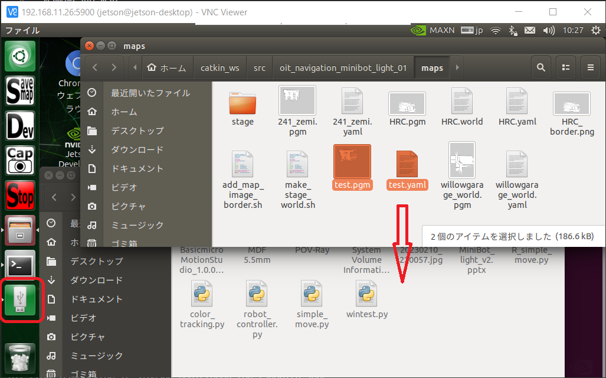

# Minibot light

演習用小型ロボットの説明。

## インストール

```shell
$ cd ~/catkin_ws/src
$ git clone https://github.com/KMiyawaki/oit_navigation_minibot_light_01.git
$ cd ~/catkin_ws/src/oit_navigation_minibot_light_01
$ ./install.sh
$ sudo sh ~/catkin_ws/src/ydlidar_ros_driver/startup/initenv.sh
$ sudo reboot
```

- テレオペや地図作成にはジョイスティックがあった方が便利。

## ロボットの起動

### 電池を接続する

コネクタの向き（リード線の色）に注意して電池を接続する。


### Jetson NANO 用の電源を ON にする

DC-DC コンバータの LED（図中指差ししている箇所）が赤くなっていなければ電源ボタンを押す。


ディスプレイに Ubuntu の画面が表示されると、Jetson NANO の起動は完了している。液晶ディスプレイはタッチパネルである。


### Logicool 無線キーボードを接続する

[K400 PLUSワイヤレス タッチ キーボード](https://www.logicool.co.jp/ja-jp/products/keyboards/k400-plus-touchpad-keyboard.920-007175.html)を使う場合は、`USB`レシーバを挿入し、キーボードの電源を`ON`にする。


### Bluetooth キーボードを接続する

[Ewin Bluetooth キーボード](https://www.amazon.co.jp/Bluetooth-%E3%82%BF%E3%83%83%E3%83%81%E3%83%91%E3%83%83%E3%83%89%E6%90%AD%E8%BC%89-%E3%83%9E%E3%83%AB%E3%83%81%E3%83%9A%E3%82%A2%E3%83%AA%E3%83%B3%E3%82%B0-Android-Windows/dp/B09YCWPTCD)を使う場合はキーボードの電源を入れ、何等かのキーを押したりタッチパッドで指をスライドさせたりしていると、Ubuntu のデスクトップ画面右上の Bluetooth アイコンにカギのマークが表示され、マウスカーソルがディスプレイに表示される。


もし表示がされないようなら Ubuntu のデスクトップ画面右上の Bluetooth マークから接続してみる。


Bluetooth キーボードはタッチパッド上で一本指でタッチするとクリック、２本指でタッチすると右クリックになっている。

### テレオペの起動

[Logicool G ゲームパッド F710r](https://gaming.logicool.co.jp/ja-jp/products/gamepads/f710-wireless-gamepad.940-000144.html)でロボットを操作する。
`LiDAR`も起動する。
ロボットの動作テストに用いる。  
ジョイスティックのレシーバを液晶ディスプレイ横の USB ポートに接続する。


デスクトップ上の`teleop`アイコンをダブルクリックする。


ジョイスティックの緑ボタンを押したまま、左スティックを倒すとロボットが走行する。  
前後に倒すと前進・後退し、左右で旋回する。斜め方向に倒すと円弧を描く。  
赤ボタンはターボボタンで、押したままジョイスティックを倒すと速く移動する。


任意のディレクトリで下記のコマンドを起動することでも起動できる。

```shell
$ roslaunch oit_navigation_minibot_light_01 teleop.launch
# teleop:=key をつけるとキーボードによるテレオペが起動する。
# その場合はXtermのウィンドウをアクティブにして矢印キーで操作する。
```

操作を終了する場合はデスクトップ左方にある`Stop`ボタンをクリックする。  
**テレオペだけでなく、後述する全ての操作において終了したい場合は`Stop`ボタンをクリックする。**


### SLAMによる地図作成

ジョイスティックでロボットを操作しながらロボット周囲の環境の地図を作成する。

デスクトップ上の`mapping`アイコンをダブルクリックする。


```shell
$ roslaunch oit_navigation_minibot_light_01 mapping.launch
# teleop:=key をつけるとキーボードによる地図作成が起動する。
# その場合はXtermのウィンドウをアクティブにして矢印キーで操作する。
```

地図を保存したい場合は、上記で起動したソフトを**絶対に終了させずに**デスクトップ左ランチャーの`save map`ボタンをクリックする。


保存が終わると自動的にファイルマネージャで保存場所が開かれる。


今回は、必ず`test.pgm`、`test.yaml`という名前でマップが保存されるように設定してあるため、既にファイルがある状態でマップを保存するとファイルが上書きされるので注意すること。

ターミナルで以下のコマンドを実行して地図を保存することもできる。

```shell
$ roscd oit_navigation_minibot_light_01/maps
$ rosrun map_server map_saver -f test # test の部分は任意の地図名をつけられる。
[ INFO] [1615598383.151895509]: Waiting for the map
[ INFO] [1615598383.434767477]: Received a 480 X 736 map @ 0.050 m/pix
[ INFO] [1615598383.434929931]: Writing map occupancy data to sample_01.pgm
[ INFO] [1615598383.449962167]: Writing map occupancy data to sample_01.yaml
[ INFO] [1615598383.450234503]: Done
```

保存ができたら、`mapping`で起動したソフトを終了させてよい。  
その後地図ファイルの有無を確認する。

```shell
$ roscd oit_navigation_minibot_light_01/maps
$ ls test* # test は保存時につけた地図名
test.pgm
test.yaml
```

保存した地図はシミュレータの作成に使うので`USB`メモリにコピーする。  
タッチパネル横にある`USB`コネクタに`USB`メモリを挿入する。


デスクトップ左方の`USB`メモリのアイコンをクリックするとファイルマネージャで`USB`メモリが開く。  
ドラッグ＆ドロップ、もしくはファイルを右クリックしてコピー＆ペーストすればコピーできる。



`Save map`ボタンクリック時に開いたターミナルが残っている場合は、閉じておくこと。

### ナビゲーション

前項で保存した地図を使いナビゲーション（自律移動）をする。  

デスクトップ上の`Nav`ボタンをダブルクリックすると、ナビゲーションが実行される。
今回は必ず`test.pgm`と`test.yaml`（前項で作成した地図のファイル）を使ってナビゲーションするように設定してある。


起動したら、`2D Pose Estimate`ボタンで自己位置推定する。
`LiDAR`のデータ（黄色い点群）が壁（マップ上の黒い画素）におおよそ一致すれば完了。
完全に一致する必要はない。


その後、`2D Nav Goal`ボタンをクリックしてから、地図上の目的地でマウス左ボタンを押し、向かせたい方向に向けてドラッグする。


ターミナルで次のコマンドで実行することもできる。  
ここで、地図の名前とは前項で保存した地図ファイル名から拡張子を取り除いたものである。

- 例：`test.pgm  test.yaml`の場合、地図名は`test`。

```shell
$ roslaunch oit_navigation_minibot_light_01 navigation.launch map_name:=test
# map_name:=以降の文字をナビゲーション時に利用する地図名に変更する。
```

自己位置推定、ゴール指定方法はこれまで通り。

## 緊急停止

ロボット右側のスイッチを後方に倒すと緊急停止できる。  
あまり強くレバーを押すと折れる場合があるので、必要以上に力を入れないように注意すること。


## VNC

ロボットと`PC`を同じネットワークに接続すれば`VNC`でリモート操作可能である。
[`FS030W`](https://fsi-plusf.jp/products/FS030W/)などのモバイルルータも利用できる。

`FS030W`を使う場合はプッシュボタンの長押しで電源`ON/OFF`し、`ON`した後、再度プッシュボタンを押すと`SSID`などの情報を閲覧できるので、ロボット搭載の`Jetson NANO`と`PC`をルータに接続する。


`VNC`のソフトは[RealVNC](https://www.realvnc.com/en/connect/download/viewer/?lai_sr=10-14&lai_sl=l)等を使う。

`RealVNC`起動後に`Jetson NANO`の`IP`アドレスを入力すると接続できる。  
パスワードは事前に別途通知したものを使う。


## ロボットの電源を OFF にする

- ロボット側端末で Jetson NANO をシャットダウンする。

```shell
$ sudo shutdown -h now
```

- 起動時に押下した、Jetson NANO 用の電源スイッチを OFF にする。
  - DC-DC コンバータの LED が消灯する。

## 作成した地図をシミュレータで使う

```shell
$ roscd oit_navigation_minibot_light_01/maps
$ ls test* # 地図のファイルを確認
test.pgm  test.yaml
$ ./make_stage_world.sh test.yaml
Add black border into test.pgm... 
Generated test_border.png
$ ls test* # 地図とシミュレータのファイルを確認
test.pgm  test.world  test.yaml  test_border.png
$ roslaunch oit_navigation_minibot_light_01 stage_navigation.launch map_name:=test
```

### Stage によるナビゲーション

```shell
$ roslaunch oit_navigation_minibot_light_01 stage_navigation.launch map_name:=test # map_name:=以降の文字をナビゲーション時に利用する地図名に変更する。
```

## ロボットから電池を外して充電する

- コネクタのロックを十分に押して完全に外す。
- リード線ではなく、コネクタをしっかりと掴んで引き抜く。
  - リード線を強引に引っ張ると、DC-DC コンバータからリード線が抜けてしまう。注意して引き抜くこと。


- 充電器に電池を接続し、 NiMH のLEDが点灯していることを良く確認して BATTERY ボタンを長押しする。
  - NiMH の LED が点灯していない場合は BATTERY ボタンを複数回押して NiMH に合わせる。
- NiMH の LED が赤く点灯し充電が始まる。
  - 充電中は点滅する。詳細は[充電器のマニュアル](https://hitecrcd.co.jp/download/x1nano-jpn/)を参照。


- NiMH の LED が緑色に点灯すると充電は完了している。


## ソフトのアップデート

以下のコマンドでロボットのソフトをアップデートできる。ただし、パッケージ`oit_navigation_minibot_light_01`に加えた変更は全て消去される。

```shell
$ roscd oit_navigation_minibot_light_01
$ git fetch
$ git checkout main
$ git reset --hard origin/main
$ git pull
Already up to date.
```
